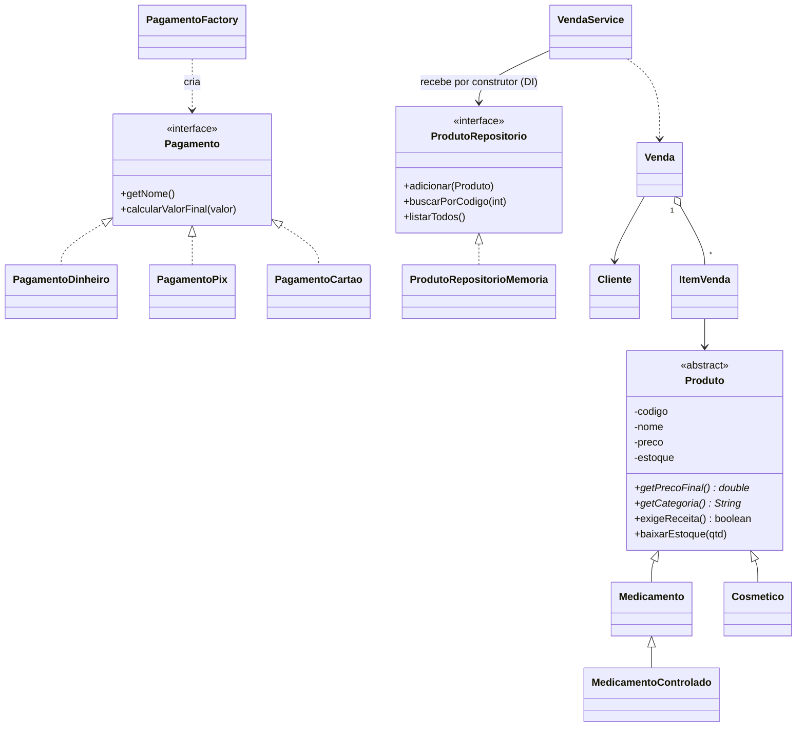

# Sistema de Farmácia (POO em Java)

Compilar e rodar (dentro de `farmacia/`):
```
mkdir out
javac -d out src/farmacia/*.java
java -cp out farmacia.app.Main
```

## Diagrama de classes (Mermaid)


## Onde cada requisito aparece
| Requisito | Onde |
|---|---|
| Associação | `Venda` -> `Cliente`, `ItemVenda` -> `Produto` |
| Coleções | `List<ItemVenda>` em `Venda`, `List<Produto>` no repositório |
| Herança | `Produto` -> `Medicamento` -> `MedicamentoControlado`; `Produto` -> `Cosmetico` |
| Polimorfismo | `getPrecoFinal()`, `exigeReceita()`, `calcularValorFinal()` |
| Interface | `ProdutoRepositorio`, `Pagamento` |
| Exceções | 3 exceções próprias + try/catch no `Main` |
| Injeção de Dependência | `VendaService(ProdutoRepositorio)` — injeção por construtor, montada no `Main` |
| SOLID | **DIP** (o serviço depende da interface, não da classe concreta); também OCP (novo pagamento sem alterar código existente) |
| Padrão de projeto | **Factory** — `PagamentoFactory.criar(...)` |

## Roteiro de defesa
1. **Demo:** rodar `Main` (lista estoque, venda com sucesso, 4 erros tratados).
2. **Diagrama:** explicar a hierarquia de `Produto` e as duas interfaces.
3. **DI:** mostrar o construtor de `VendaService` e a linha `new VendaService(repositorio)` no `Main`. Vantagem: dá para trocar por um repositório em arquivo/banco sem mexer no serviço.
4. **SOLID (DIP):** `VendaService` só conhece `ProdutoRepositorio`. Quem escolhe a implementação concreta é o `Main`.
5. **Factory:** o código cliente pede `"pix"` e recebe um `Pagamento`, sem saber qual classe concreta é criada; se aparecer "boleto", basta criar `PagamentoBoleto` e uma linha na factory.
6. **Perguntas prováveis:** diferença entre DI e Factory; por que `Produto` é abstrata; por que checked exceptions; o que muda se adicionar um novo tipo de produto (nada no serviço = OCP).
